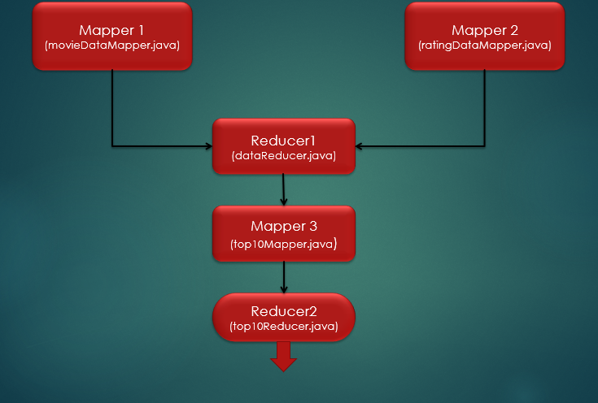
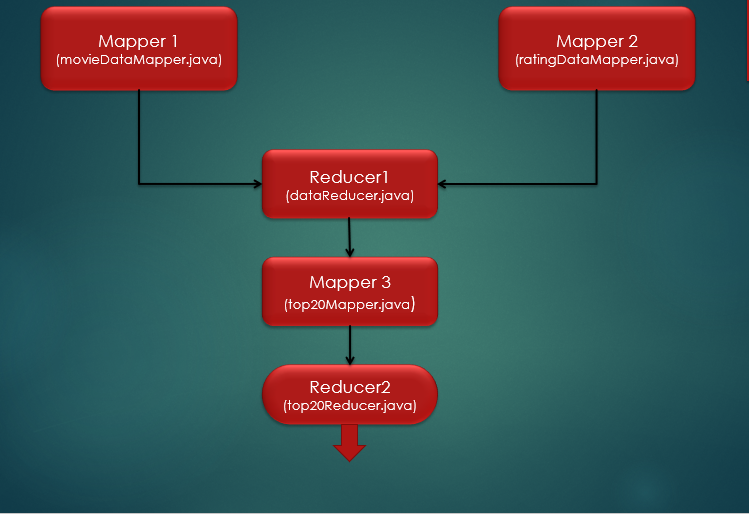
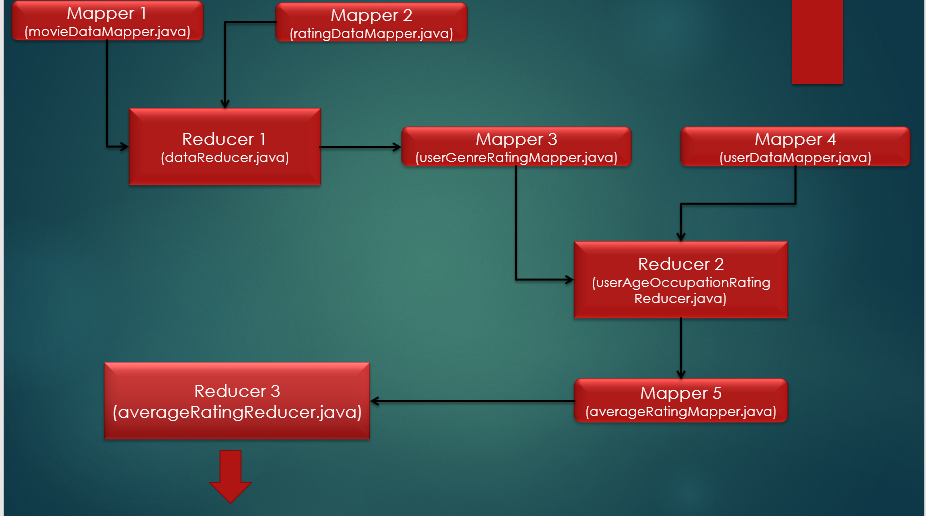
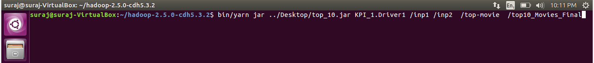
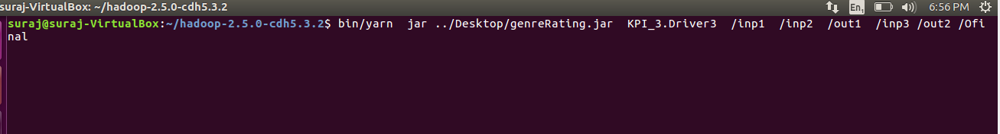
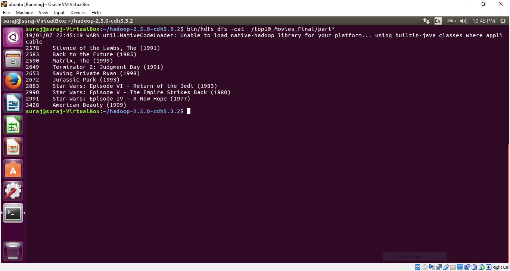
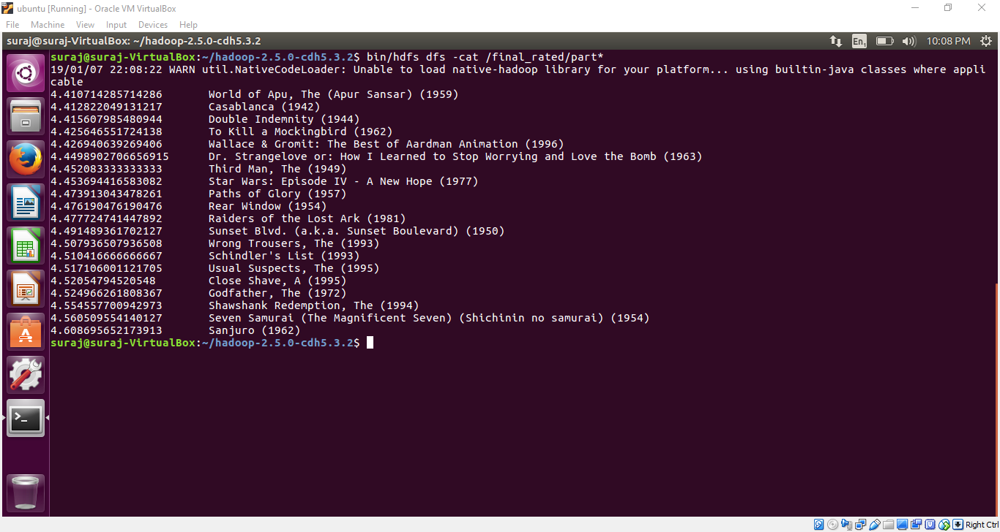

# Movie_Lens_Data-Analysis
The objective of this project is to analyse the Movie lens dataset and solve various KPIs.


## Table of Contents ##
 - [Data Format](#data-format)
 - [Prerequisites](#prerequisites)
 - KPIs()
  - [KPI 1](#kpi-1)
  - [KPI 2](#kpi-2)
  - [KPI 3](#kpi-3)
 - [Code](#code)
 - [Output](#output)


###  Data Format
 #### 1. movies: (movies.dat)
    - MovieID::Title::Genres

Titles are identical to titles provided by the IMDB (including year of release).
Genres are pipe-separated and are selected from the following genres:
- Action
- Adventure
- Animation
- Children's
- Comedy
- Crime
- Documentary
- Drama
- Fantasy
- Film-Noir
- Horror
- Musical
- Mystery
- Romance
- Sci-Fi
- Thriller
- War
- Western


#### 2. ratings: (ratings.dat)
    - UserID::MovieID::Rating::Timestamp
- UserIDs range between 1 and 6040
- MovieIDs range between 1 and 3952
- Ratings are made on a 5-star scale (whole-star ratings only)
- Timestamp is represented in seconds since the epoch as returned by time(2)

#### 3. users: (users.dat)
    - UserID::Gender::Age::Occupation::Zip-code
- Gender is denoted by a "M" for male and "F" for female
- Age is chosen from the following ranges:
  - 1: "Under 18"
  - 18: "18-24"
  - 25: "25-34"
  - 35: "35-44"
  - 45: "45-49"
  - 50: "50-55"
  - 56: "56+"
  
- Occupation is chosen from the following choices:
  - 0: "other" or not specified
  - 1: "academic/educator"
  - 2: "artist"
  - 3: "clerical/admin"
  - 4: "college/grad student"
  - 5: "customer service"
  - 6: "doctor/health care"
  - 7: "executive/managerial"
  - 8: "farmer"
  - 9: "homemaker"
  - 10: "K-12 student"
  - 11: "lawyer"
  - 12: "programmer"
  - 13: "retired"
  - 14: "sales/marketing"
  - 15: "scientist"
  - 16: "self-employed"
  - 17: "technician/engineer"
  - 18: "tradesman/craftsman"
  - 19: "unemployed"
  - 20: "writer"
  
  ### Prerequisites:
   - Use Ubuntu or any flavour of Linux with following installed
     - Hadoop 2.x or above 
     - JDK

 
  ## KPIs ##      
  ## KPI 1 ##
    ### Recommend top 10 most watched movies. ###
     - We need count of each movie to solve this problem and to do so we need to process data from **movies.dat** and **ratings.dat** files.
       - We use the concept of **Job chaining** in MapReduce for doing these multiple tasks. 
       
         
       
     -  We get movie_id  **(key)**  and name **(value)** as output from **movieDataMapper** and movie_id **(key)**  and 1 **(value)** as output from **ratingDataMapper**.
     - Output of both the mappers is processed at **dataReducer** and  movie_id  **(key)** and its total count **(value)** is given as output.
     - Now the output of reducer  movie_id and it's count is given as input to **top10Mapper** where we find **local** top10 records.
     - The output from the mapper is given to **top10Reducer** which finds the **global** top 10 records.
       - **TreeMap** class of java is used to find the top 10 records. 
    
    
    
    
    
   ## KPI 2 ##   
     ### Recommend top 20 rated movies provided it's atleast watched/rated by 40 users. ###
     - We need the average rating for each movie to solve this problem to do so we need to process data from **movies.dat** and **ratings.dat** files.
       - We use the concept of **Job chaining** in MapReduce for doing these multiple tasks. 
     
         
     
     - We get movie_id  **(key)**  and name **(value)** as output from **movieDataMapper** and movie_id **(key)**  and rating **(value)** as output from **ratingDataMapper**.
     - Output of both the mappers is processed in **dataReducer** and  movie_id  **(key)** and average rating **(value)** is given as output.
     - Now the output of reducer  movie_id and it's average rating  is given as input to **top20Mapper** where we find **local** top20 records.
     - The output from the mapper is given to **top20Reducer** which finds the **global** top 20 records.
       - **TreeMap** class of java is used to find the top 20 records.  
   
   ## KPI 3 ##
     ### How have the genres ranked by Average Rating, for each profession and age group. The age groups to be considered are: 18-35, 36-50 and 50+. ###
     - To find average rating of a genre for each profession and age group we have process all the three files i.e **movie.dat** , **rating.dat** and **user.dat**.
       - We use the concept of **Job chaining** in MapReduce for doing these multiple tasks.
       
         
     
     - We get movie_id **(key)** and genre **(value)** as output from **movieDataMapper** and movie_id **(key)** and concatenation of user_id+rating **(value)** from ratingDataMapper.
     - Output of both the mappers is processed at **dataReducer** and  user_id  **(key)** and genre+rating **(value)** is given as output.
     - Output of the reducer is given as input to **userGenreRatingMapper**,which gives user_id **(key)**  and concatenation of  genre+rating **(value)** as output.  
     - *user.dat* is given as input to **userDataMapper**, which gives user_id **(key)**   and concatenation of  age+occupation **(value)** as output.
     - Now the output from both the mappers is given as input to the reducer **userAgeOccupationRatingReducer**, which gives 
     concatenation of age+occupation+genre **(key)**  and rating **(value)** as output
     
     - The output of the reducer is given to **averageRatingMapper** where  filteration based on age groups is done and concatenation of age+occupation+genre **(key)**  and rating **(value)** are given as output.
     - This is the final reducer which gets the input from the mapper and calculates the average rating. It produces average_rating **(key)** and concatination of age+occupation+genre **(value)** as the final output.
     
     
     ## Code ## 
     - Start the hadoop services. <br/>
         ``` sbin/start-all.sh ```
       
     - Copy movies.dat , ratings.dat and users.dat from local file system to inp1 , inp2, and inp3 folders respectively present in HDFS<br/>
      ` bin/hdfs dfs -put  ../Desktop/movies.dat   /inp1 `<br/>
       ` bin/hdfs dfs -put  ../Desktop/ratings.dat   /inp2 `<br/>
       ` bin/hdfs dfs -put ../Desktop/users.dat   /inp3  `
     -  **KPI 1**
        - Giving output paths and using  yarn services to run jar the file. 
        
     
     - **KPI 2**
        - Giving output paths and using  yarn services to run jar the file. 
        
      
     - **KPI 3**
       - Giving output paths and using  yarn services to run jar the file. 
       
      
     
     ## Output ##
     - **KPI 1**
        
        
     - **KPI 2**
        
     
     - **KPI 3**
        
       
